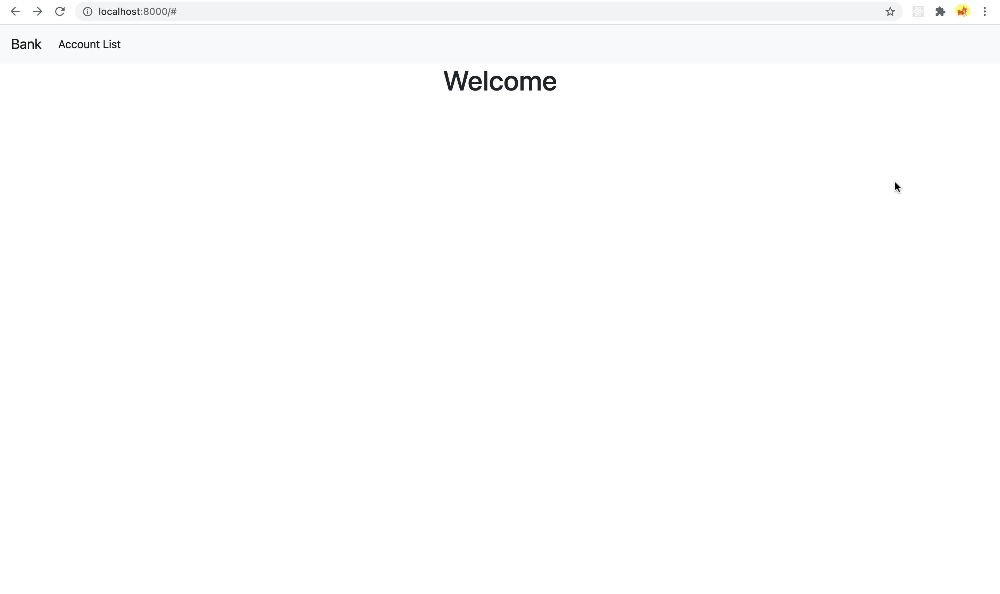
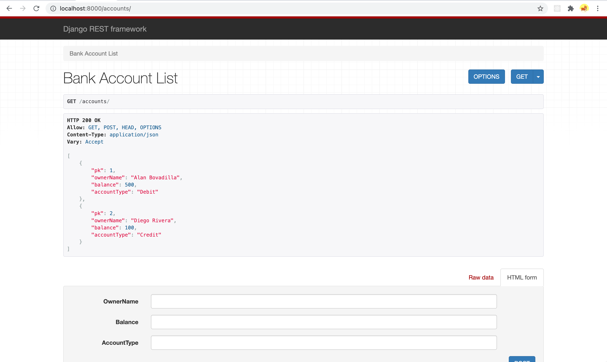
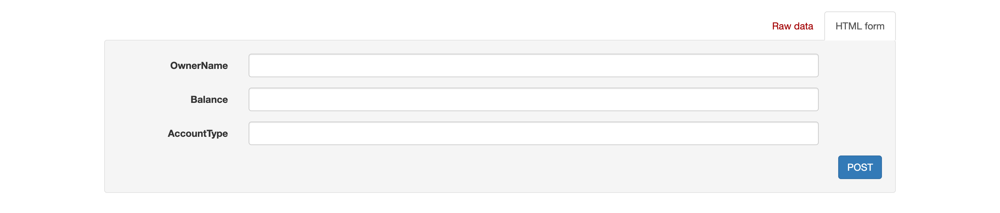
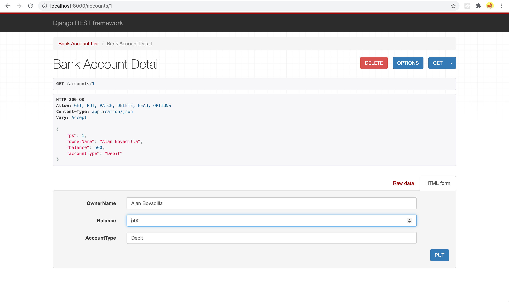
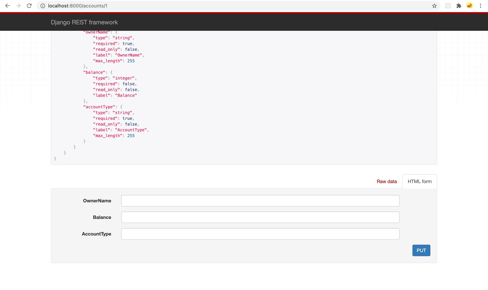
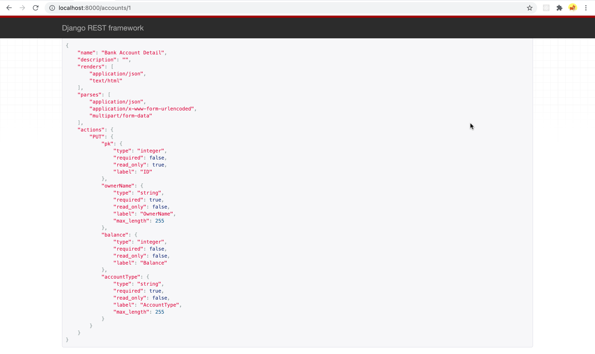
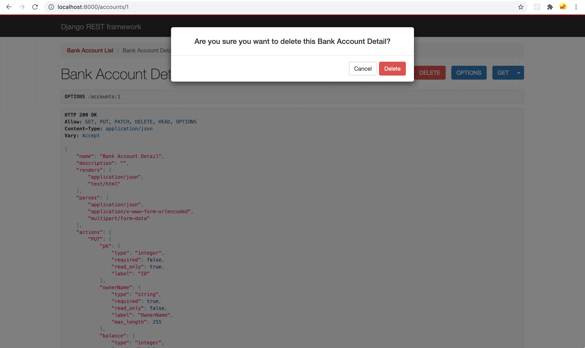

# Django REST API

This REST API project is a bank account's API based on 'Django REST Framework' where you are able to visualize a list of registered 
bank accounts and perform HTTP methods.

## Used Technologies
<a href="#"></a>
<a href="#"></a>
<a href="#"></a>

## Usage
Download the repository
```
git clone https://github.com/alanBovadilla97/REST_API_DJANGO.git
```
Run it in the console with the command
```
python manage.py runserver [port]
```
Then open the project in your browser in localhost server with the port previously indicated
```
localhost:[port]
```
The homepage will be open.


The, in the navbar you can click the option 'Account List' or type on the browser
```
localhost:[port]/accounts/
```

And you'll be redirected to the page where we can see a list of the registered bank accounts


If you want to POST a new account, go to the bottom of the page and input the following fields (All the fields are required):
```
* OwnerName: [String]
* Balance: [Int]
* AccountType: [String]
```


To be able to preview a specific account, enter in your browser the identifier(pk) of that account like this:
```
localhost:[port]/accounts/[pk]
```


Here you are going to see the specific information for that account. In order to modify the information of this account, go
to the bottom of the page and press 'PUT'


To open the API's structure press the button 'OPTIONS'


An finally, to perform the DELETE method, press the 'DELETE' button


A confirmation dialog will appear, to finally perform the operation press 'Delete'

## Credits
®2021. Alan Jair Bovadilla Huerta
